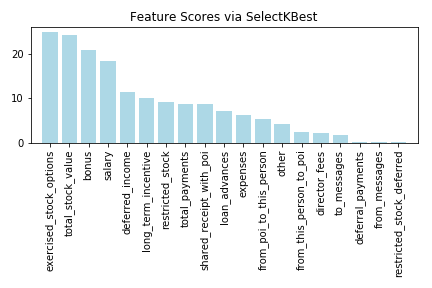
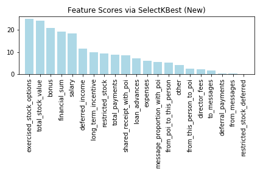
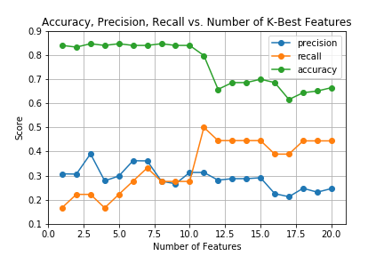

# Identify Fraud from Enron Email

### Introduction
In 2000, Enron was one of the largest companies in the United States. By 2002, it had collapsed into bankruptcy due to widespread corporate fraud. In the resulting Federal investigation, there was a significant amount of typically confidential information entered into the public record, including tens of thousands of emails and detailed financial data for to executives. Subsequently, a copy of the database was purchased and released to public by Andrew McCallum. The dataset was used widely for machine learning studies. In this project, I built a machine learning model using `scikit-learn` built-in algorithm to predict a "person of interest" (POI) - who were indicted, reached a settlement or plea deal with the government, or testified in exchange for prosecution immunity.

### Short Questions
> Summarize for us the goal of this project and how machine learning is useful in trying to accomplish it. As part of your answer, give some background on the dataset and how it can be used to answer the project question. Were there any outliers in the data when you got it, and how did you handle those?

The goal of this project is to utilize the financial data and communication records to build a predictive model to identify a "person of interest" (POI), who may be considered as involved in Enron fraud.  The dataset contained 146 records with 14 financial features, 6 email features, and 1 labeled feature (POI). Of the 146 records, 18 were labeled as persons of interest. And the total data points number is 3066, of which 1708 are valid data points. The percentage of data validity is about 55.7%, which means nearly half of the data is missing. Through exploratory data analysis (EDA) of the dataset, I was able to identify 3 records as outliers: 

+ `TOTAL` - an extreme outlier for most numerical features, as it was a financial summation for all individuals. 
+ `THE TRAVEL AGENCY IN THE PARK` - not an individual in Enron company. 
+ `LOCKHART EUGENE E` - this record does not contain much useful data.

> What features did you end up using in your POI identifier, and what selection process did you use to pick them? Did you have to do any scaling? Why or why not? As part of the assignment, you should attempt to engineer your own feature that doesn't come ready-made in the dataset--explain what feature you tried to make, and the rationale behind it. If you used an algorithm like a decision tree, please also give the feature importance of the features that you use.

In order to optimize and select the most relevant features, I have applied the `feature_selection.SelectKBest` module from `scikit-learn` package. I've created a plot that ranks the different features in the dataset by their , and the top ten feature scores are listed below: 



 Features | Score
------------ | ------------- 
exercised_stock_options | 24.815
total_stock_value | 24.183
bonus | 20.792
salary | 18.290
deferred_income | 11.458
long_term_incentive| 9.922
restricted_stock | 9.213
total_payments | 8.773
shared_receipt_with_poi | 8.589
loan_advances|7.184

Before the feature selection process, I have engineered two new features, one for financial features group, and another one for email features. The created new financial feature, `financial_sum`, is the combination of `salary`, `bonus` and `total_stock_value`, which represents the payment and investment income that an individual has earned from company. The new engineered email feature, `message_proportion_with_poi`, is the ratio of the total number of emails to and from a POI to the total number of emails sent or received. These two features were added to the `features_list` for features selection. And the most significant ten features and related impact scores are listed in the table below:



 Features | Score
------------ | ------------- 
exercised_stock_options | 24.815
total_stock_value | 24.183
bonus | 20.792
__financial_sum__ | __19.225__
salary | 18.290
deferred_income | 11.458
long_term_incentive| 9.922
restricted_stock | 9.213
total_payments | 8.773
shared_receipt_with_poi | 8.589

It is noteworthy that the new feature `financial_sum` has relatively high impact score (19.225),  while new email feature  `message_proportion_with_poi` was not selected as top 10 features. And among the top 10 selected features, 9 of them are related with financial features, only one email feature `shared_receipt_with_poi` has been selected, which also indicates that email communication data does not present significant influence as financial data for POI identification. In order to determine how many features to use in the final algorithm, I have created a plot of metrics by different number of K-Best features in GaussianNB classifier. The figure is shown as below:  



As the requested threshold for precision and recall is 0.3, `k=7` is the first point where both scores reach above 0.3. K=11 is another point where both scores are above 0.3, but at this point accuracy score is slightly lower. To balance the computation amount and algorithm performance, I decide to use `k=7` as final number of k-best features. And the feature list would be:
 ```
exercised_stock_options, total_stock_value, bonus 
financial_sum, salary, deferred_income, long_term_incentive
```
Before training the machine learning algorithm classifiers, I have scaled all selected features using a standard scalar from `preprocessing.StandardScaler` module. Since the range of values of data varies widely (e.g. `total_stock_value` and `salary`), feature-scaling can preprocess the features and ensure they are weighted equally.

> What algorithm did you end up using? What other one(s) did you try? How did model performance differ between algorithms?  

The final algorithm that I ended up using is Gaussian Naive Bayes. As the prediction outcomes are of binary classification (POI or non-POI) and the input data (financial data, message data) are of continuous numerical values, it is plausible to use GaussianNB classifier to train the data. Naive Bayes classifiers assume that the value of a particular feature is independent of the value of any other feature. The algorithm is very efficient and easy to run for small dataset, and the probability for possible classes or outcomes can be computed by given features using Bayes' theorem. 

In order to compare the machine learning algorithms, I have tried 6 different algorithms, and I also evaluate the performance of these algorithms with Principal Component Analysis (PCA). The algorithms are listed as below:  
```
	1. Gaussian Naive Bayes (Gaussian NB) 
	2. Support Vector Machines (SVC) 
	3. K Nearest Neighbors (KNN)
	4. Stochastic Gradient Descent (SGD)
	5. K-Means
	6. Random Forests
```
To check the performance difference between algorithms, I have evaluated them by `evaluate_clf` function. And evaluation metrics for each algorithm is listed below: 

Classifier | Score | Precision | Recall 
------------ | ------------- | ------------|------
__Gaussian Naive Bayes__ | 0.881 | 0.333  | 0.250
Support Vector Machines| 0.809 | 0 |0
Neareat Neighbors |0.881 |0.333 |0.250
Stochastic Gradient Descent| 0.652 | 0.780 |0.149
K-Means | 0.758 | 0.403 | 0.791
Random Forests | 0.907 | 0.381 | 0.393

 The above tables show that GaussianNB performed reasonably well for this dataset, with relatively high evaluation metrics. SGD has the top precision score (0.780) among the six algorithms, while K-Means has best recall (0.791) score. Though Random Forests classifier takes the longest computation time, it will prevent the overfitting problem. 

 I also checked check the algorithm performance in Principal Component Analysis (PCA). To parallel the comparison, I set `n_components=3` for all classifiers, thought it might not be the best `n_components` parameter for each classifier. Function `get_pca_n_components` from `data_tools` can help to find the optimal n_component value, in which `GridSearchCV` is utilized. The validation results is shown as following table: 

Classifier (PCA=True)| Score | Precision | Recall
------------ | ------------- | ------------|------
Gaussian Naive Bayes | 0.905 | 0.333  | 0.333
Support Vector Machines| 0.762 | 0 |0
Neareat Neighbors | 0.881|0.333 |0.250
Stochastic Gradient Descent| 0.626 | 0.757 |0.147
K-Means | 0.690 | 0.430 | 0.667
Random Forests | 0.906 | 0.219 | 0.233


PCA does improve the performance for K-Means classifier, both accuracy and precision scores get increased, as its accuracy score is relatively low among all classifiers, so K-Means was not selected as final algorithm. For other classifiers, SVM, K-Neighbors, SGD and Random Forests, performance does not get much improvements with PCA. As using PCA increases the amount of calculation, which will lower the computation speed for the algorithm, we also need to consider to balance the effectiveness and performance. Using  `get_pca_n_components` function, the optimal component value `n_components=0` was identified for GaussianNB(), therefore PCA was not included in the final algorithm. 


> What does it mean to tune the parameters of an algorithm, and what can happen if you don’t do this well?  How did you tune the parameters of your particular algorithm? (Some algorithms do not have parameters that you need to tune -- if this is the case for the one you picked, identify and briefly explain how you would have done it for the model that was not your final choice or a different model that does utilize parameter tuning, e.g. a decision tree classifier).  

The purpose of algorithm tuning is to find the best point or points in the classifier where performance can be optimum. The more tuned the parameters of an algorithm, the more specific the algorithm will be for the training data and test sets. This strategy can be effective, but it can also lead to more peculiar models that overfit the test sets and don’t perform as well in general practice.

There is no parameters that need to be tuned for Gaussian Naive Bayes. So I choose to tune the `tol` for K-means clustering using exhaustive searches. The K-means clustering was initialized with 2 clusters(`n_clusters`) which represents POI and non-POI clusters. Below is the list of `tol` numbers that I used to tune for the classifier: 
```
parameters = {"tol": [1e-15, 1e-10, 1e-5, 1e-4, 1e-3, 1e-2, 1e-1]}
k_clf = GridSearchCV(k_clf, parameters) 
```
The optimized parameter value is `tol=1e-10`, and the evaluation metrics (via `evaluate_clf` function) for optimized K-Means Clustering is

Score | Precision | Recall
------------ | ------------- | -----------
0.907 | 0.400| 0.667

> What is validation, and what’s a classic mistake you can make if you do it wrong? How did you validate your analysis? 

The validation is technique for assessing how the performance of a machine learning algorithm that generalizes to a dataset. A common mistake that happens in training an classifier is overfitting, which occurs when a model begins to "memorize" training data rather than "learning" to generalize from trend. To validate my analysis, I have used two evaluation methods:

* `evaluate_clf` function from `data_tools.py` generates 1000 randomized trials for the dataset, which is split into training and testing set, and averages the accuracy, precision and recall. 
* `tester.py` the provided K-folds (k=1000) evaluator is used as a second
validation to generate metrics on the classifiers.

> Give at least 2 evaluation metrics and your average performance for each of them.  Explain an interpretation of your metrics that says something human-understandable about your algorithm’s performance. [relevant rubric item: “usage of evaluation metrics”]

Precision and recall scores are commonly used evaluation metrics. In this study, precision represents the ratio of true positives to the records that are actually 'POI', which suggests how often 'false alarms' happens. Recall is the ratio of true positives to the records flagged as 'POI', which means how sensitive for the algorithm. Due to the limitedness of POIs numbers (18 out of 146) and the unbalanced distribution of numerical data, 'accuracy' would not be a good evaluation metric.

__GaussianNB(priors=None)__

Validation | Accuracy | Precision | Recall
------|------|------|------
`evaluate_clf`| 0.881 | 0.333  | 0.250
`tester.py`|0.840| 0.429|0.354	

For the final algorithm (Gaussian NB) I chose, it performed reasonably well because it showed relative high precision and recall scores in both validations. High precisions ensures truly capture the actual “POI”, while a high recall score ensures culpable individuals are included and labeled as “POI”. 


### Conclusion
In this project, I utilized GaussianNB algorithm to build a predictive identifier to investigate person who may be involved in Enron fraud. Similar models may have application potentials for other types of financial checking, such as online payment / digit payment, credit card fraud identification. To improve the GaussianNB algorithm model, we can explore more features from email corpus for data training and test in the further analysis. And as many data is missing in current dataset version, we can gather more information to improve the integrity of the dataset, or pre-process the data by filling in missing values by certain algorithm. There is a few more optional outliers in the dataset, we can implement the Tukey's Inter Quartile Range method to identify these outliers and remove them for building a more accurate predictive model. 


-------

### Reference

* [Udacity | Intro to Machine Learning Course](https://www.udacity.com/course/intro-to-machine-learning--ud120
)
* [Choosing the right estimator](http://scikit-learn.org/stable/tutorial/machine_learning_map)
* [Python Scikit Learn Cheat Sheet](https://s3.amazonaws.com/assets.datacamp.com/blog_assets/Scikit_Learn_Cheat_Sheet_Python.pdf)
* [Wikipedia Cross-validation ](https://en.wikipedia.org/wiki/Cross-validation_(statistics))
* [Wikipedia Naive Bayes classifier](https://en.wikipedia.org/wiki/Naive_Bayes_classifier)
* [Supervised Machine Learning: A Review of Classification Techniques](https://s3-us-west-2.amazonaws.com/mlsurveys/54.pdf)
* [Do we Need Hundreds of Classifiers to Solve Real World Classification Problems?](http://jmlr.org/papers/v15/delgado14a.html)
* [Python Machine Learning - Chapter 4 - Building Good Training Sets – Data Pre-Processing](https://github.com/rasbt/python-machine-learning-book/blob/master/code/ch04/ch04.ipynb)
* [Selecting dimensionality reduction with Pipeline and GridSearchCV](http://scikit-learn.org/stable/auto_examples/plot_compare_reduction.html#sphx-glr-auto-examples-plot-compare-reduction-py)
